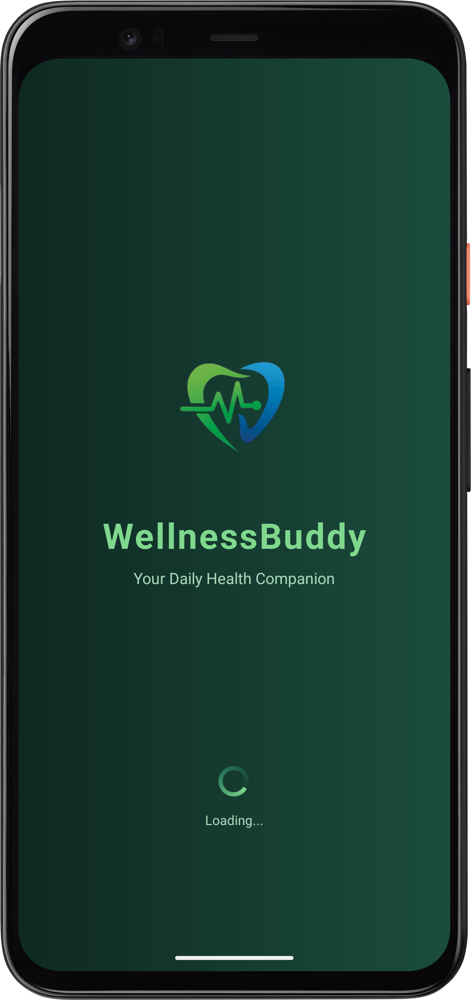
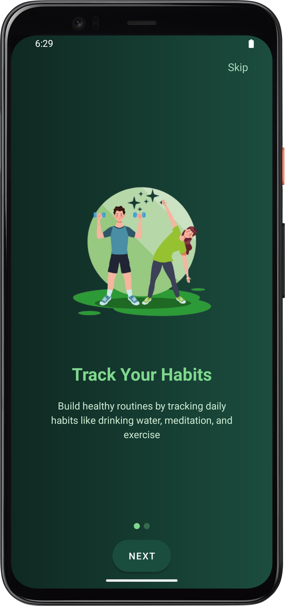
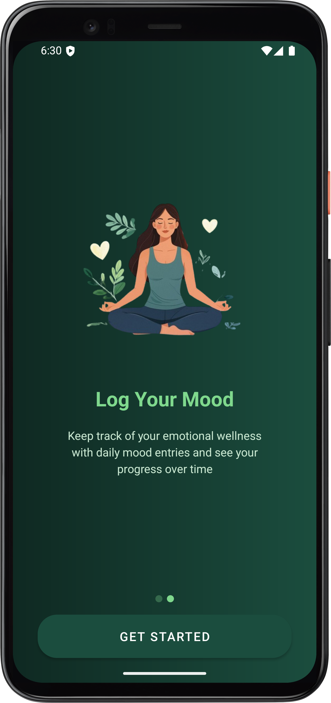
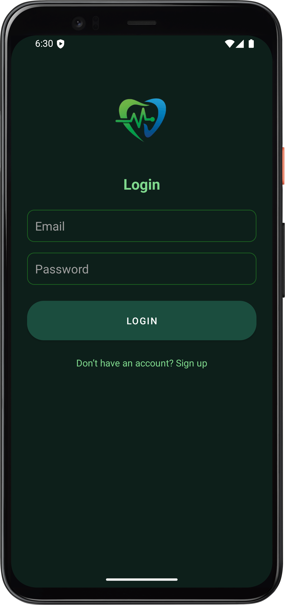
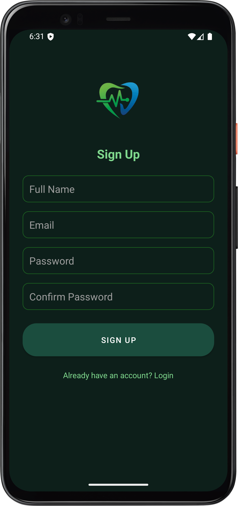
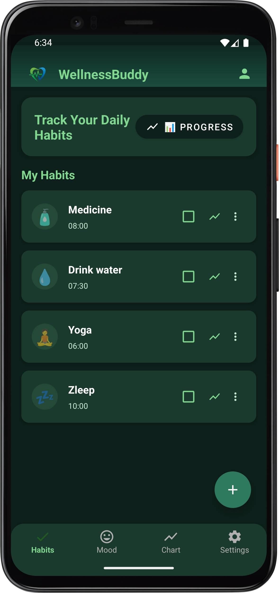
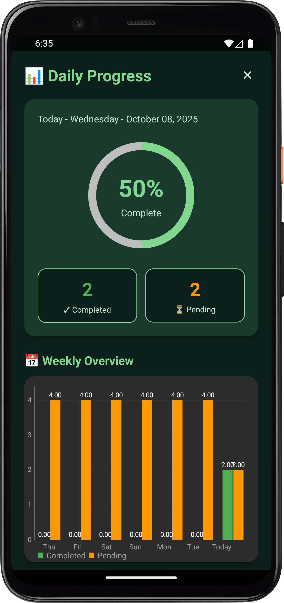
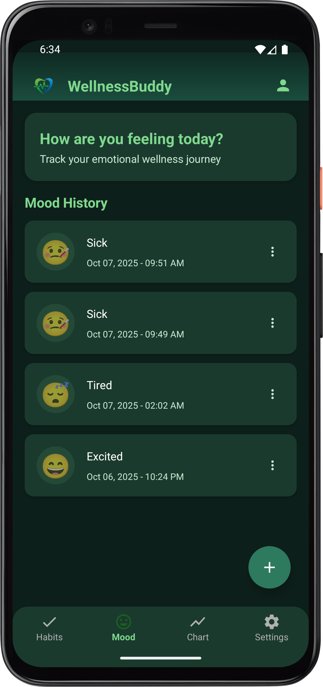
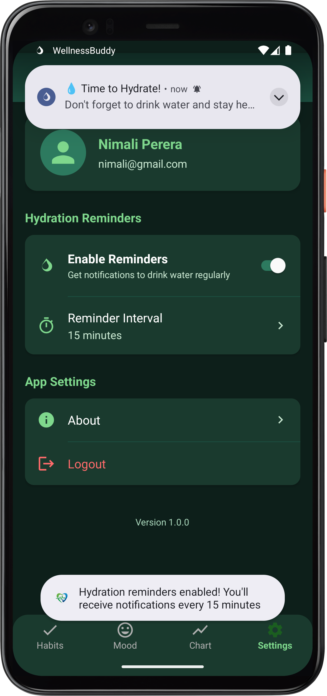
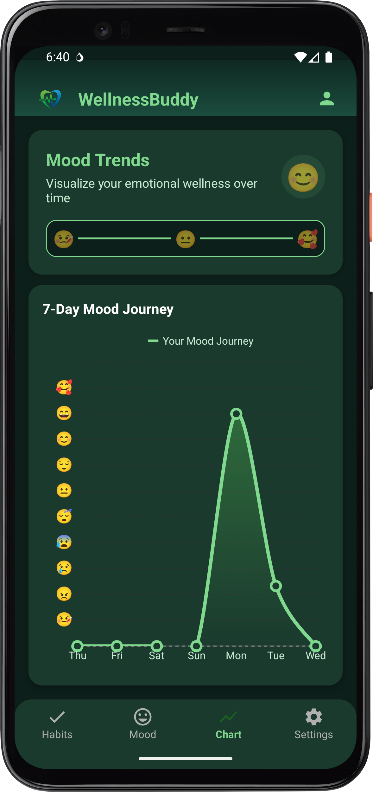

# 💚 **WellnessBuddy – Your Personal Wellness Companion**

<p align="center">
  
</p>

### 🌱 *Empower your mind, body, and routine with balance and positivity.*

---

## 🧘‍♀️ **Overview**
**WellnessBuddy** is an Android mobile application designed to help users build healthy habits, track their moods, and stay consistent with hydration reminders, all in one beautiful, calm interface.

Built with a nature-inspired **dark green theme**, WellnessBuddy focuses on simplicity, mindfulness, and user well-being.

---

## ✨ **Main Features**

| 🌿 Feature | 💡 Description |
|-------------|----------------|
| **🌅 Launch & Onboarding** | Animated launch screen followed by smooth onboarding screens introducing the app. |
| **🔐 Login & Signup** | Secure user authentication with validation and data persistence using SharedPreferences. |
| **📆 Habit Tracker** | Add, edit, and delete your daily habits, each with an emoji, name, and time. Display habit progress of each day |
| **😊 Mood Journal** | Log your daily mood using expressive emojis and optional notes. |
| **💧 Hydration Reminder** | Get regular notifications reminding you to drink water and stay hydrated. |
| **📊 7 Days Mood Entry Chart** | visually represent Mood entry of each day. |


---

## 🧩 **Tech Stack**

| Tool | Purpose |
|------|----------|
| **Kotlin** | Core app development |
| **XML** | UI design layouts |
| **Android Studio** | Development environment |
| **SharedPreferences + Gson** | Local data storage and serialization |
| **RecyclerView + Adapters** | Efficient list management for habits and moods |
| **Material Design Components** | Modern UI elements (cards, buttons, dialogs) |
| **WorkManager** | Background hydration notifications |

---

## ⚙️ **Installation Guide**

1. Clone this repository:
   ```bash
   git clone https://github.com/Tharushi111/WellnessBuddy.git
   ```
2. Open the project in **Android Studio**.
3. Build and run on an emulator or real Android device.
4. Minimum SDK: **API 24 (Android 7.0)**

---

## 🌈 **Color Palette (60–30–10 Rule)**

| Usage | Color | HEX |
|--------|--------|------|
| Dominant (60%) | Primary Dark Green | `#0F2922` |
| Secondary (30%) | Surface Dark / Green | `#1A3A2E` |
| Accent (10%) | Accent Green | `#7FD88D` |

---

## 🖼️ **App UI's**

| Launch | Onboarding | Login | Signup |
|:--:|:--:|:--:|:--:|
|  |  | |  |  |

| Home (Habits) | Mood Journal | Add Habit | Hydration Notification |
|:--:|:--:|:--:|:--:|
|  | |  |   | |

---

## 🔔 **Hydration Reminder (WorkManager)**
💧 WellnessBuddy uses **WorkManager** to send timely hydration reminders, even when the app is closed.  
Notifications include motivational messages and open the app when tapped.

---

## 💾 **Data Storage**
All data is saved securely using **SharedPreferences**:
- User login details  
- Habits and completion history  
- Mood entries  
- Hydration reminder preferences  

Gson is used for JSON serialization of objects to ensure easy storage and retrieval.

---

## 🧠 **State Management**
- The app preserves state using SharedPreferences and adapters.
- Fragment states (like habits/moods lists) remain consistent while navigating.
- UI instantly updates when users add or delete data.

---

## 🎨 **UI/UX Highlights**
- Followed **Material Design 3** guidelines.  
- Used **ConstraintLayout** for responsive design across all screen sizes.  
- Applied **60-30-10 color balance rule** for visual harmony.  
- Minimal animations to enhance focus and calmness.  

---

## 🌟 **Acknowledgments**
Special thanks to my lecturer, instructors and colleagues for guidance and feedback throughout this project.  
This app was developed as part of my **Mobile Application Development Module Lab Exam 03 (2025)**.

---

## 📜 **License**
This project is licensed under the **MIT License** — feel free to use and improve with proper credits.

---

## 💬 **Final Note**
> WellnessBuddy isn’t just an app — it’s a small step toward a more mindful, healthy lifestyle.  
> Stay consistent. Stay hydrated. Stay well. 💧💚
